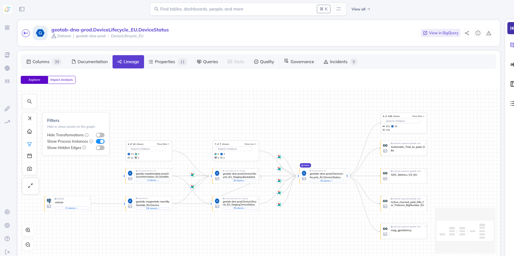

# Datahub

This DAG ingest all data (GBQ, Postgre, Airflow, Superset) into Datahub.

**POC: Hongda Zhu, hongdazhu@geotab.com**

## Airflow practice links
- [Airflow & DAG Best Practices and Standards doc](https://docs.google.com/document/d/1j-w94Ty4jXIkJnfD6lOLQRo0SFbSL1Pof-bM9X2oRNE/edit?usp=sharing)
- [SQL Style Guide](https://docs.google.com/document/d/1U1V-BF9MgQXDEBXAXrSAz3vNLdG4-zlrFS2ttFkfy6E/edit)
- [SQL Optimization Guide](https://docs.google.com/document/d/1N2U3ya6tP8eLTqv7U2SInByQTj7IV6Ty-oPSWJlpQAs/edit)
- [Current standard DAG template](https://git.geotab.com/data-pipelines/templates/dna_dag_template)

### Automated Deployment
- [Automated Deployment Guide](https://git.geotab.com/data-pipelines/dataops_protected/dataops-runner-templates/-/tree/v1?ref_type=heads#user-guide)
- [Tutorial for refactoring existing projects for GitLab Runner](https://docs.google.com/presentation/d/1M24-nF3DbGJRHMdXa_PkNaodANGmxryh7Dy0mJ8sBaQ/edit?usp=drive_link)

